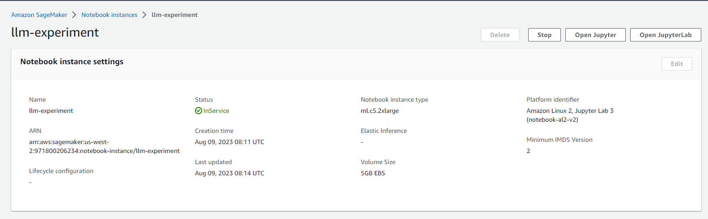
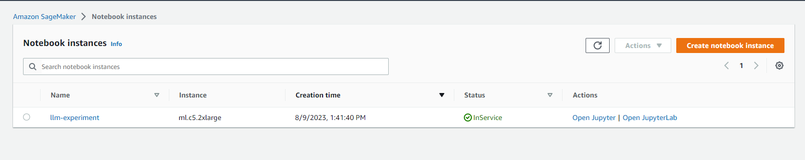
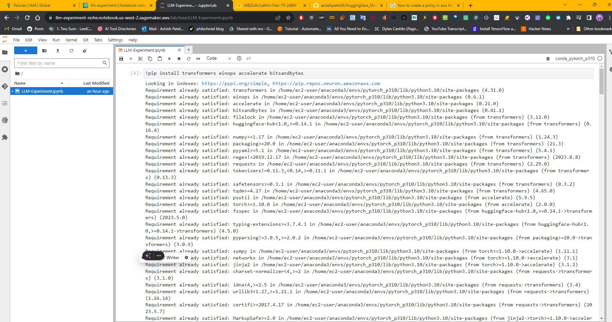
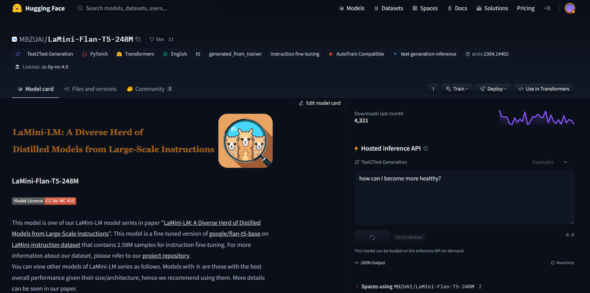
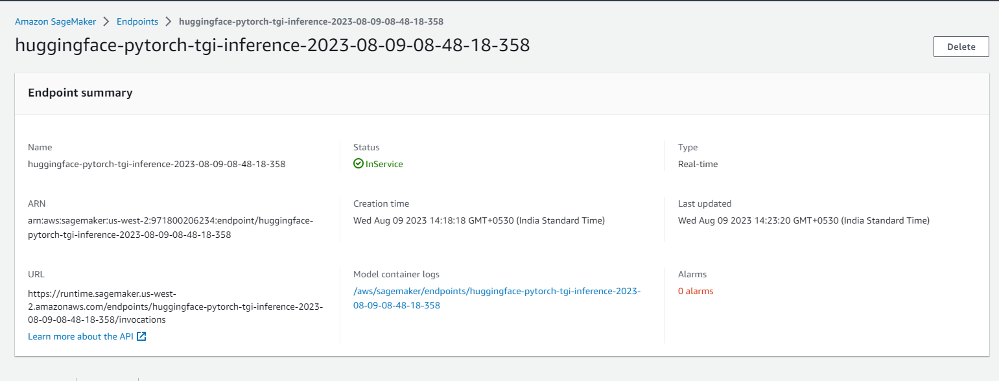

# HuggingFace Model Deployment On SageMaker
**Hugging Face Model Deployment On SageMaker**

## **Full Video**

## 1. Create the Notebook Instance

## 2. Run Notebook

## 3.Open JupyterLab

## 4.Model on HuggingFace : **[LaMiNi](https://huggingface.co/MBZUAI/LaMini-Flan-T5-248M)**

## 5. Deployment Endpoint

